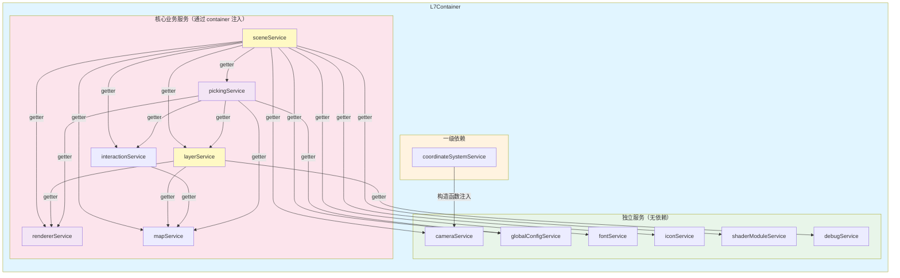
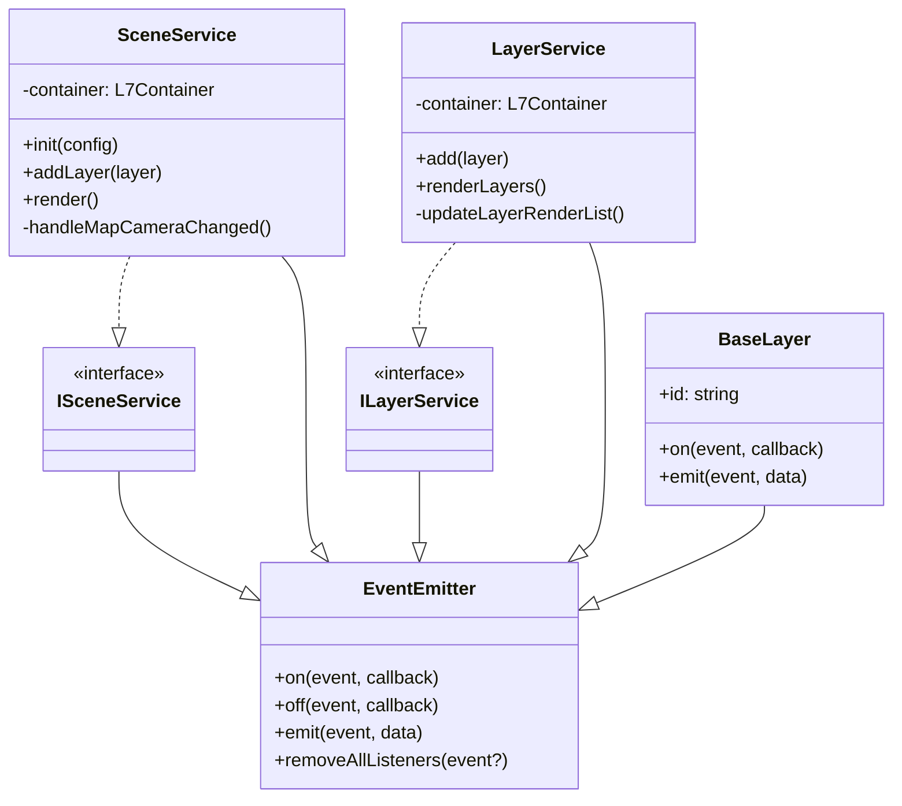
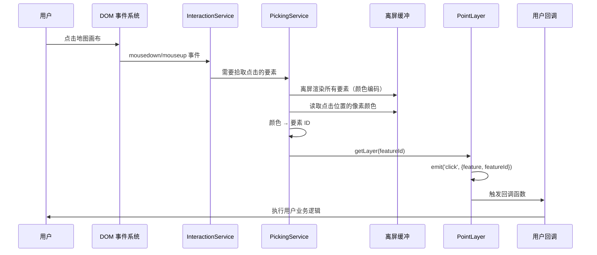
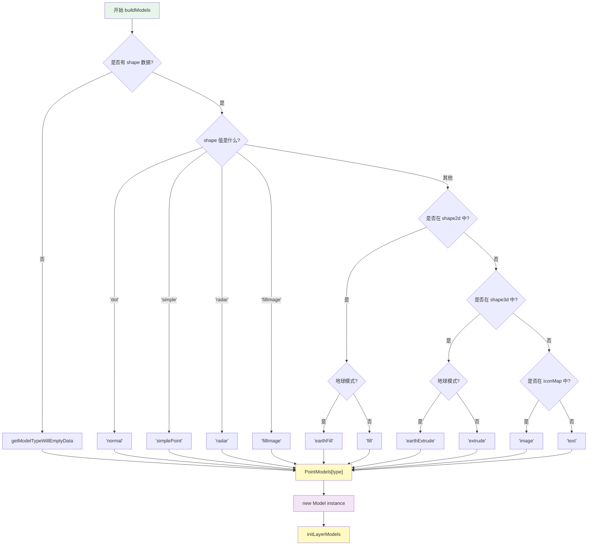
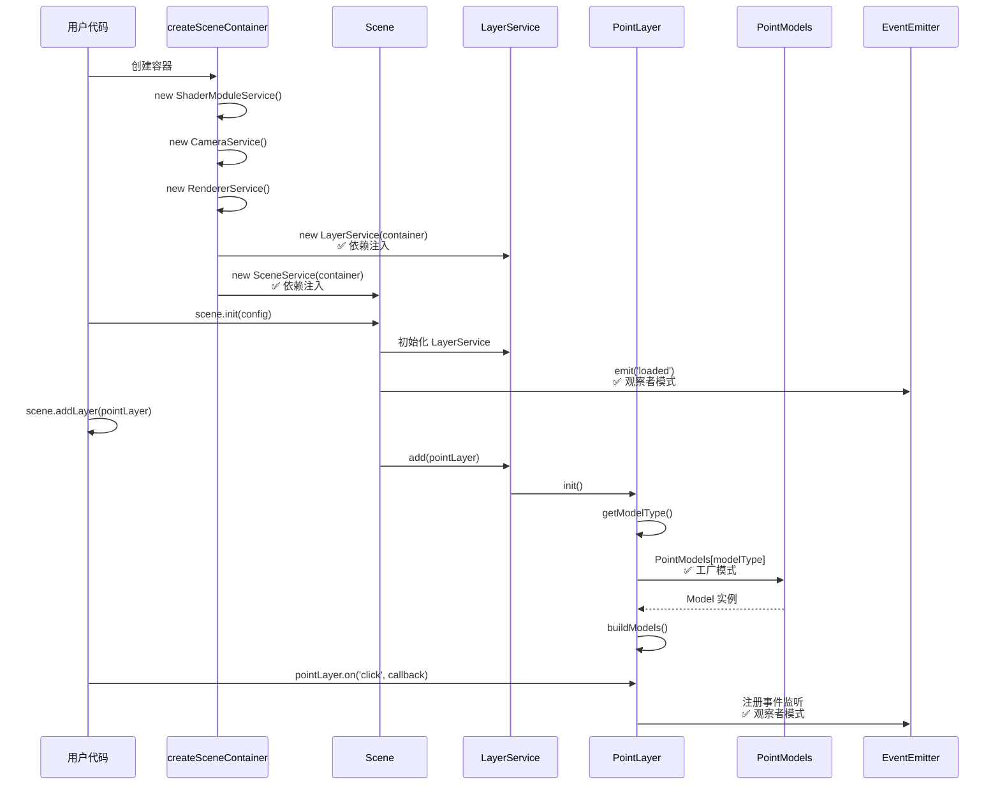
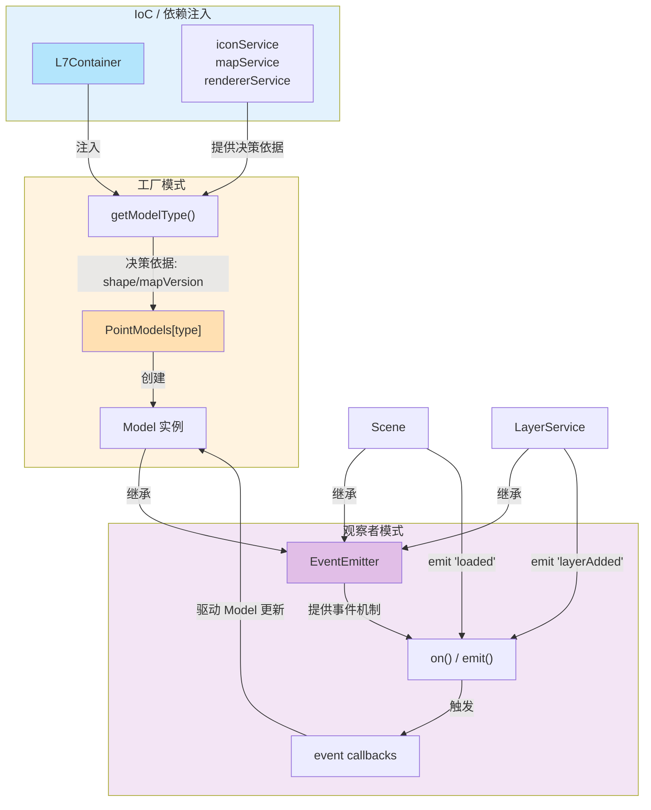

# L7 核心设计模式分析

> 对应学习计划：`1.2 设计模式补充`
>
> 分析范围：控制反转（IoC）与依赖注入（DI）| 观察者模式 | 工厂模式

## 概述

L7 作为 AntV 团队的 WebGL 地理空间数据可视化引擎，在架构上运用了三种核心设计模式来实现模块解耦、灵活创建和事件驱动通信：

- **IoC/DI**：通过手工 IoC 容器 + 构造函数注入管理 15+ 个服务的依赖关系
- **观察者模式**：基于 EventEmitter3 实现 Scene、Layer、Service 间的事件通信
- **工厂模式**：通过 Model 工厂根据数据特征动态选择渲染策略

本文将逐一分析每种模式的概念、L7 的具体实现方式，以及三者如何协作构成 L7 的核心架构。

---

## 一、控制反转（IoC）与依赖注入（DI）

### 1.1 概念讲解

#### IoC（Inversion of Control，控制反转）—— 设计思想

**IoC 是一种设计思想（设计原则），不是具体的技术实现。** 它的核心含义是：将对象的创建和依赖关系的管理权从程序自身转移给外部容器或框架。

- **正转（传统方式）**：程序主动 `new` 对象，自己控制依赖关系
- **反转（IoC 方式）**：由外部容器负责创建对象并管理依赖，对象被动接收所需的依赖

Martin Fowler 将 IoC 描述为框架的根本特征："Don't call us, we'll call you"（好莱坞原则）—— 不是你的代码调用框架，而是框架调用你的代码。

#### DI（Dependency Injection，依赖注入）—— 实现方式

**DI 是 IoC 的一种具体实现方式。** 它通过构造函数、Setter 方法或接口，将依赖对象从外部注入到目标对象中，而非由目标对象自己创建。

DI 的三种注入形式：

- **构造函数注入（Constructor Injection）**：通过构造函数参数传入依赖（L7 采用此方式）
- **Setter 注入（Setter Injection）**：通过 setter 方法设置依赖
- **接口注入（Interface Injection）**：实现特定接口来接收依赖

#### 二者的关系

| 对比维度     | IoC（控制反转）                                                | DI（依赖注入）                         |
| ------------ | -------------------------------------------------------------- | -------------------------------------- |
| **本质**     | 设计思想 / 设计原则                                            | 具体实现方式 / 设计模式                |
| **层级**     | 上层概念（What：做什么）                                       | 下层实现（How：怎么做）                |
| **描述角度** | 从容器角度：容器控制对象的创建与依赖                           | 从应用角度：对象被动接收外部注入的依赖 |
| **范围**     | 更广泛，DI、Service Locator、Template Method 等都是 IoC 的实现 | IoC 的一种具体实现方式                 |

> 简单来说：**IoC 是"做什么"——反转控制权；DI 是"怎么做"——通过注入依赖来实现控制反转。**

**IoC + DI 的优势**：

- ✅ 降低耦合度（对象不需要知道如何创建依赖）
- ✅ 便于测试（可注入 mock 对象）
- ✅ 便于维护（依赖关系集中管理）

### 1.2 L7 的 IoC 实现：通过 DI 构建的轻量级容器

L7 **没有使用** Inversify/TypeDI 等重型 IoC/DI 框架，而是 **手工实现了一个轻量级 IoC 容器**，采用 **构造函数注入（Constructor Injection）** 作为 DI 方式。

- **IoC 体现**：`L7Container` 作为 IoC 容器，统一管理所有服务的创建和生命周期，服务不再自行创建依赖
- **DI 体现**：通过构造函数参数 `container` 将依赖注入到各个服务中

**容器创建流程**：[`packages/core/src/inversify.config.ts`](../packages/core/src/inversify.config.ts)

```typescript
// 核心函数：createSceneContainer()
export function createSceneContainer(): L7Container {
  // 1️⃣ 创建基础服务实例（不依赖其他服务）
  const shaderModuleService = new ShaderModuleService();
  const debugService = new DebugService();
  const cameraService = new CameraService();
  const coordinateSystemService = new CoordinateSystemService(cameraService);
  const fontService = new FontService();
  const iconService = new IconService();

  // 2️⃣ 创建容器对象，装载这些服务
  const container: L7Container = {
    id: `${sceneIdCounter++}`,
    globalConfigService,
    shaderModuleService,
    debugService,
    cameraService,
    coordinateSystemService,
    fontService,
    iconService,
    // ... 其他服务
    customRenderService: {},
  };

  // 3️⃣ 依赖注入：后期创建的服务通过构造函数接收 container
  const layerService = new LayerService(container); // 注入 container
  container.layerService = layerService;

  const sceneService = new SceneService(container); // 注入 container
  container.sceneService = sceneService;

  const interactionService = new InteractionService(container); // 注入 container
  container.interactionService = interactionService;

  // 4️⃣ 工厂函数模式：通过闭包保存服务实例
  const normalPass: Record<string, IPass<unknown>> = {
    clear: new ClearPass(),
    pixelPicking: new PixelPickingPass(),
    render: new RenderPass(),
  };
  container.normalPassFactory = (named: string) => {
    return normalPass[named]; // 按需返回服务
  };

  return container;
}

// Layer 相关服务的专用容器
export function createLayerContainer(sceneContainer: L7Container) {
  const layerContainer = {
    ...sceneContainer, // 继承所有 Scene 的服务
  };

  // 新增 Layer 特定的服务
  layerContainer.postProcessor = new PostProcessor(layerContainer.rendererService);
  layerContainer.multiPassRenderer = new MultiPassRenderer(layerContainer.postProcessor);
  layerContainer.styleAttributeService = new StyleAttributeService(layerContainer.rendererService);

  return layerContainer;
}
```

**容器接口定义**：[`packages/core/src/inversify.config.ts`](../packages/core/src/inversify.config.ts#L39-L64)

```typescript
export interface L7Container {
  id: string;
  globalConfigService: IGlobalConfigService;
  shaderModuleService: IShaderModuleService;
  layerService: ILayerService;
  rendererService: IRendererService;
  sceneService: ISceneService;
  cameraService: ICameraService;
  coordinateSystemService: ICoordinateSystemService;
  interactionService: InteractionService;
  mapConfig: Partial<IMapConfig>;
  mapService: IMapService;
  fontService: IFontService;
  iconService: IIconService;
  // 工厂函数
  normalPassFactory: (name: string) => IPass<unknown>;
  postProcessingPassFactory: (named: string) => IPostProcessingPass<unknown>;
  // ...
}
```

### 1.3 使用者如何获取依赖

**示例 1：SceneService 如何访问其他服务**

[`packages/core/src/services/scene/SceneService.ts`](../packages/core/src/services/scene/SceneService.ts#L30-L80)

```typescript
export default class Scene extends EventEmitter implements ISceneService {
  // 注入 container
  constructor(private container: L7Container) {
    super();
  }

  // 通过 getter 访问其他服务（延迟访问，确保服务已初始化）
  private get iconService() {
    return this.container.iconService; // ✅ 从容器获取
  }

  private get fontService() {
    return this.container.fontService; // ✅ 从容器获取
  }

  private get rendererService() {
    return this.container.rendererService; // ✅ 从容器获取
  }

  private get layerService() {
    return this.container.layerService; // ✅ 从容器获取
  }

  public init(sceneConfig: ISceneConfig) {
    // 使用注入的服务
    this.iconService.init();
    this.iconService.on('imageUpdate', () => this.render());

    this.fontService.init();

    this.layerService.add(layer);
  }
}
```

**示例 2：LayerService 如何访问其他服务**

[`packages/core/src/services/layer/LayerService.ts`](../packages/core/src/services/layer/LayerService.ts#L29-L36)

```typescript
export default class LayerService extends EventEmitter implements ILayerService {
  private get renderService() {
    return this.container.rendererService; // ✅ 从容器获取
  }

  private get mapService() {
    return this.container.mapService; // ✅ 从容器获取
  }

  constructor(private container: L7Container) {
    super();
  }
}
```

### 1.4 优势总结

| 方面               | L7 的实现                                                                |
| ------------------ | ------------------------------------------------------------------------ |
| **IoC 思想**       | 服务不自行创建依赖，由 `createSceneContainer()` 统一管理控制权           |
| **DI 实现方式**    | 构造函数注入 `container`，服务通过 getter 延迟获取依赖                   |
| **依赖管理**       | 单一 `L7Container` 对象，所有服务集中                                    |
| **生命周期**       | 由 `createSceneContainer()` 和 `createLayerContainer()` 两个工厂函数管理 |
| **优化**           | Getter 模式延迟访问，避免循环依赖问题                                    |
| **对比 Inversify** | 更轻，无反射开销，代码直观，但需手工管理                                 |

### 1.5 IoC 容器架构图



---

## 二、观察者模式（Observer Pattern）

### 2.1 概念讲解

**观察者模式** 定义了对象间的 **一对多依赖关系**。当一个对象的状态改变时，所有依赖于它的对象都会自动得到通知。

**角色**：

- **Subject（被观察者）**：维护观察者列表，状态改变时通知所有观察者
- **Observer（观察者）**：注册到 Subject，收到通知时做出反应

**特点**：

- Subject 和 Observer **彼此知道对方的存在**（松耦合，但非完全解耦）
- 通知过程通常是 **同步** 的（Subject 直接调用 Observer 的方法）
- 适用于 **单一应用内部** 的模块通信

### 2.2 观察者模式 vs 发布订阅模式

观察者模式和发布订阅模式（Pub/Sub）经常被混淆，但它们有本质区别：

```
观察者模式：    Subject ←——→ Observer        （直接通信）
发布订阅模式：  Publisher → Broker → Subscriber （通过中间人）
```

| 对比维度      | 观察者模式（Observer）             | 发布订阅模式（Pub/Sub）                            |
| ------------- | ---------------------------------- | -------------------------------------------------- |
| **角色**      | Subject + Observer（两个角色）     | Publisher + Broker + Subscriber（三个角色）        |
| **耦合度**    | 松耦合：Subject 持有 Observer 列表 | 完全解耦：Publisher 和 Subscriber 互不知道对方存在 |
| **通信方式**  | Subject 直接调用 Observer 的方法   | 通过 Broker（事件总线/消息队列）间接通信           |
| **同步/异步** | 通常同步                           | 通常异步（如消息队列）                             |
| **应用范围**  | 单一应用内部                       | 可跨应用/分布式系统                                |
| **关系**      | 一对多                             | 多对多                                             |
| **典型实现**  | EventEmitter、DOM 事件             | Redis Pub/Sub、Kafka、EventBus                     |

> **L7 使用的是观察者模式。** L7 的 EventEmitter 中，Subject（如 Scene）直接持有 Observer（回调函数）的引用列表，调用 `emit()` 时同步遍历并执行所有回调。没有独立的"消息代理"层。

### 2.3 L7 中的观察者模式：基于 EventEmitter3

L7 **使用第三方库** `eventemitter3` 实现观察者模式。这库提供了轻量级的事件系统。

**核心实现**：所有需要事件通信的服务都继承 `EventEmitter`。

#### 2.3.1 Scene 的事件系统

[`packages/core/src/services/scene/ISceneService.ts`](../packages/core/src/services/scene/ISceneService.ts)

```typescript
// 接口定义：Scene 继承 EventEmitter
export interface ISceneService extends EventEmitter {
  destroyed: boolean;
  loaded: boolean;
  init(config: ISceneConfig): void;
  addLayer(layer: ILayer): void;
  // ...
}

// Scene 定义的事件列表
export const SceneEventList: string[] = [
  'loaded', // Scene 初始化完成
  'fontloaded', // 字体加载完成
  'maploaded', // 地图加载完成
  'resize', // 窗口/容器大小改变
  'destroy', // Scene 销毁
  'dragstart', // 拖拽开始
  'dragging', // 正在拖拽
  'dragend', // 拖拽结束
  'dragcancel', // 拖拽取消
];
```

**实现类**：[`packages/core/src/services/scene/SceneService.ts`](../packages/core/src/services/scene/SceneService.ts#L1-L30)

```typescript
import { EventEmitter } from 'eventemitter3';

export default class Scene extends EventEmitter implements ISceneService {
  private get iconService() {
    return this.container.iconService;
  }

  public init(sceneConfig: ISceneConfig) {
    // 监听图标更新事件（观察者模式：Scene 订阅 iconService 的事件）
    this.iconService.on('imageUpdate', () => {
      this.render(); // 图标更新时重新渲染
    });

    // 设置 map 的相机变化回调
    this.map.onCameraChanged((viewport: IViewport) => {
      this.cameraService.update(viewport);
    });

    this.render();

    // 在适当的时机发送事件（观察者模式：Scene 作为 Subject 通知 Observer）
    this.emit('loaded'); // ✅ 通知所有监听 'loaded' 的观察者
    this.emit('resize'); // ✅ 通知所有监听 'resize' 的观察者
  }
}
```

**用户使用示例**：

```typescript
const scene = new Scene({ id: 'container' });

// 订阅事件
scene.on('loaded', () => {
  console.log('Scene 加载完成');
});

scene.on('dragstart', () => {
  console.log('开始拖拽地图');
});

scene.on('resize', () => {
  console.log('窗口大小改变');
});
```

#### 2.3.2 LayerService 的事件系统

[`packages/core/src/services/layer/LayerService.ts`](../packages/core/src/services/layer/LayerService.ts#L1-L30)

```typescript
import { EventEmitter } from 'eventemitter3';

export default class LayerService extends EventEmitter<LayerServiceEvent> implements ILayerService {
  constructor(private container: L7Container) {
    super();
  }

  public add(layer: ILayer) {
    this.layers.push(layer);
    if (this.sceneInited) {
      layer.init().then(() => {
        this.renderLayers();
        // ✅ 可在此处发送 'layer-added' 事件
        this.emit('layerAdded', layer);
      });
    }
  }
}
```

#### 2.3.3 BaseLayer 的事件系统

[`packages/layers/src/core/BaseLayer.ts`](../packages/layers/src/core/BaseLayer.ts#L1-L50)

```typescript
import { EventEmitter } from 'eventemitter3';

export default class BaseLayer<ChildLayerStyleOptions = {}>
  extends EventEmitter<LayerEventType>
  implements ILayer
{
  public id: string = `${layerIdCounter++}`;

  constructor() {
    super();
  }

  // Layer 支持的事件类型
  // 'click'、'mouseover'、'mouseout' 等交互事件
  // 'dataUpdate' 数据更新事件
  // 'styleUpdate' 样式更新事件
}
```

**Layer 交互事件触发流程**：

```
用户点击地图
  ↓
DOM 事件捕获
  ↓
InteractionService 翻译为 L7 事件
  ↓
PickingService 进行像素拾取（确定点击了哪个要素）
  ↓
Layer.emit('click', { feature })  ✅ 触发 click 事件
  ↓
用户回调被执行
```

### 2.4 事件系统的完整场景

**场景**：用户点击地图上的一个点

```typescript
// 1. 创建点图层并监听 click 事件
const pointLayer = new PointLayer();
pointLayer.source(data);
pointLayer.on('click', (e) => {
  console.log('点击了特征：', e.feature);
});
scene.addLayer(pointLayer);

// 事件流转：
// 1. 用户在地图上点击 → DOM click 事件
// 2. InteractionService 捕获事件，转发给 PickingService
// 3. PickingService 通过颜色编码拾取确定点击的要素
// 4. layer.emit('click', { feature: features[pickedId] })
// 5. 用户回调执行
```

### 2.5 优势总结

| 方面         | L7 的实现                                                                        |
| ------------ | -------------------------------------------------------------------------------- |
| **模式选择** | 观察者模式（非 Pub/Sub），Subject 直接持有 Observer 引用                         |
| **框架选择** | eventemitter3（轻量、同步、可用于浏览器/Node.js）                                |
| **应用范围** | Scene、LayerService、BaseLayer、所有交互事件                                     |
| **事件类型** | 生命周期事件（loaded、destroy）、交互事件（click、drag）、数据事件（dataUpdate） |
| **解耦程度** | 松耦合：Subject 不关心 Observer 的具体实现，但持有其引用                         |

### 2.6 观察者模式类图



### 2.7 事件流程图：从用户点击到 Layer 回调



---

## 三、工厂模式（Factory Pattern）

### 3.1 概念讲解

**工厂模式** 是创建型设计模式，用于 **将对象创建的逻辑封装** 在工厂类/函数中，而不是由客户端直接 `new`。

**目的**：

- ✅ 隐藏具体实现，提供统一的接口
- ✅ 支持动态决策创建哪个具体类的实例
- ✅ 便于扩展新的产品类型

**工厂模式的变体**：

- **简单工厂**：一个工厂类，通过 `type` 参数决定创建哪个产品
- **工厂方法**：每个产品类有对应的工厂类
- **抽象工厂**：工厂本身也有继承体系

### 3.2 L7 中的工厂模式：Layer 的创建

#### 3.2.1 Layer 简单工厂模式

**Layer 导出模块**：[`packages/layers/src/index.ts`](../packages/layers/src/index.ts)

```typescript
// 所有 Layer 类型集中导出
export {
  BaseLayer,
  BaseModel,
  CanvasLayer,
  CityBuildingLayer,
  EarthLayer,
  GeometryLayer,
  HeatmapLayer,
  ImageLayer,
  LineLayer,
  MaskLayer,
  PointLayer,
  PolygonLayer,
  RasterLayer,
  TileDebugLayer,
  TileLayer,
  WindLayer,
};
```

**用户使用**：

```typescript
// 直接导入需要的 Layer 类
import { PointLayer, LineLayer, PolygonLayer } from '@antv/l7';

// 创建具体的 Layer 实例
const pointLayer = new PointLayer();
const lineLayer = new LineLayer();
const polygonLayer = new PolygonLayer();
```

#### 3.2.2 Model 的工厂：PointLayer 示例

**PointLayer 的 Model 工厂**：[`packages/layers/src/point/index.ts`](../packages/layers/src/point/index.ts)

```typescript
import PointModels from './models/index';

export default class PointLayer extends BaseLayer<IPointLayerStyleOptions> {
  public type: string = 'PointLayer';

  // Model 工厂方法：根据 modelType 创建不同的 Model
  public async buildModels() {
    // 1️⃣ 根据 data 和 shape 类型决定用哪个 Model
    const modelType = this.getModelType(); // 返回 'normal'|'image'|'text'|'fill' 等

    if (this.layerModel) {
      this.layerModel.clearModels();
    }

    // 2️⃣ 从 PointModels 工厂对象中获取对应的 Model 类
    this.layerModel = new PointModels[modelType](this); // ✅ 工厂

    await this.initLayerModels();
  }

  // 决策逻辑：根据 shape 正确判定要使用哪个 Model
  public getModelType(): PointType {
    const layerData = this.getEncodedData();
    const { shape2d, shape3d, billboard = true } = this.getLayerConfig();
    const iconMap = this.iconService.getIconMap();

    const item = layerData.find((fe: IEncodeFeature) => {
      return fe.hasOwnProperty('shape');
    });

    // 决策树
    if (!item) {
      return this.getModelTypeWillEmptyData();
    }

    const shape = item.shape;

    if (shape === 'dot') {
      return 'normal'; // 普通圆点
    }
    if (shape === 'simple') {
      return 'simplePoint'; // 简单点
    }
    if (shape === 'radar') {
      return 'radar'; // 雷达图
    }
    if (this.layerType === 'fillImage' || billboard === false) {
      return 'fillImage'; // 填充图像
    }
    if (shape2d?.indexOf(shape as string) !== -1) {
      // 2D shape（如 'circle'、'square'）
      if (this.mapService.version === 'GLOBEL') {
        return 'earthFill'; // 地球模式下的 2D shape
      } else {
        return 'fill'; // 普通地图模式下的 2D shape
      }
    }
    if (shape3d?.indexOf(shape as string) !== -1) {
      // 3D shape（如 'cube'、'cylinder'）
      if (this.mapService.version === 'GLOBEL') {
        return 'earthExtrude'; // 地球模式下的 3D shape
      } else {
        return 'extrude'; // 普通地图模式下的 3D shape
      }
    }
    if (iconMap.hasOwnProperty(shape as string)) {
      return 'image'; // 图标
    }

    return 'text'; // 文字
  }
}
```

**PointModels 工厂对象**：[`packages/layers/src/point/models/index.ts`](../packages/layers/src/point/models/index.ts)（推测结构）

```typescript
import normalPointModel from './normal';
import imagePointModel from './image';
import textPointModel from './text';
import fillPointModel from './fill';
// ... 其他 Model 导入

export default {
  normal: normalPointModel,
  image: imagePointModel,
  text: textPointModel,
  fill: fillPointModel,
  simplePoint: simplePointModel,
  radar: radarPointModel,
  extrude: extrudePointModel,
  fillImage: fillImagePointModel,
  earthFill: earthFillPointModel,
  earthExtrude: earthExtrudePointModel,
  tileText: tileTextPointModel,
} as Record<PointType, typeof BaseModel>;
```

### 3.2.3 Model 工厂决策流程图



#### 3.2.4 Pass 的工厂：渲染过程工厂

[`packages/core/src/inversify.config.ts`](../packages/core/src/inversify.config.ts#L88-L105)

```typescript
export function createSceneContainer(): L7Container {
  // ... 其他服务

  // Normal Pass 工厂（主渲染通道）
  const normalPass: Record<string, IPass<unknown>> = {
    clear: new ClearPass(),
    pixelPicking: new PixelPickingPass(),
    render: new RenderPass(),
  };
  container.normalPassFactory = (named: string) => {
    return normalPass[named]; // ✅ 按名字返回 Pass 实例
  };

  // Post-Processing Pass 工厂（后处理通道）
  const postProcessingPass: Record<string, IPostProcessingPass<unknown>> = {
    copy: new CopyPass(),
    bloom: new BloomPass(),
    blurH: new BlurHPass(),
    blurV: new BlurVPass(),
    noise: new NoisePass(),
    sepia: new SepiaPass(),
    colorHalftone: new ColorHalfTonePass(),
    hexagonalPixelate: new HexagonalPixelatePass(),
    ink: new InkPass(),
  };
  container.postProcessingPass = postProcessingPass;
  container.postProcessingPassFactory = (named: string) => {
    return postProcessingPass[named]; // ✅ 按名字返回后处理 Pass 实例
  };

  return container;
}
```

### 3.3 工厂模式的优势

| 方面         | L7 的实现                                                                                  |
| ------------ | ------------------------------------------------------------------------------------------ |
| **创建隐藏** | 用户不需要知道如何创建 Layer 实例，直接 `new PointLayer()`                                 |
| **决策集中** | `getModelType()` 集中了所有 Model 选择逻辑                                                 |
| **扩展性**   | 新增 Model 类型时，只需：加 Model 类 → 更新 PointModels 工厂对象 → getModelType() 里加判断 |
| **代码质量** | 避免客户端充斥 `if-else` 或 `switch-case`                                                  |

---

## 四、模式协作：IoC + 观察者 + 工厂的联动

### 4.1 完整的创建和初始化流程



### 4.2 模式间的依赖和协作关系



**关键说明**：

- **IoC/DI 容器** 提供所有服务实例，是基础设施（IoC 是思想，DI 是实现手段）
- **工厂模式** 依赖 DI 提供的服务（如 iconService、mapService）来做决策
- **观察者模式** 贯穿整个系统，通过事件驱动模块间的联动和更新
- 三个模式 **相辅相成**，共同构成 L7 的核心架构

---

## 五、附录

### 5.1 源码路径总结

| 设计模式       | 主要文件                                                                                                    | 关键类/函数                                              |
| -------------- | ----------------------------------------------------------------------------------------------------------- | -------------------------------------------------------- |
| **IoC/DI**     | [`packages/core/src/inversify.config.ts`](../packages/core/src/inversify.config.ts)                         | `createSceneContainer()`、`createLayerContainer()`       |
|                | [`packages/core/src/services/scene/SceneService.ts`](../packages/core/src/services/scene/SceneService.ts)   | Scene 通过 `constructor(container)` 接收注入（DI）       |
|                | [`packages/core/src/services/layer/LayerService.ts`](../packages/core/src/services/layer/LayerService.ts)   | LayerService 通过 getter 访问 container                  |
| **观察者模式** | [`packages/core/src/services/scene/ISceneService.ts`](../packages/core/src/services/scene/ISceneService.ts) | `ISceneService extends EventEmitter`                     |
|                | [`packages/core/src/services/scene/SceneService.ts`](../packages/core/src/services/scene/SceneService.ts)   | `Scene extends EventEmitter`、`this.emit()`、`this.on()` |
|                | [`packages/layers/src/core/BaseLayer.ts`](../packages/layers/src/core/BaseLayer.ts)                         | `BaseLayer extends EventEmitter`                         |
| **工厂模式**   | [`packages/layers/src/index.ts`](../packages/layers/src/index.ts)                                           | 所有 Layer 类型导出                                      |
|                | [`packages/layers/src/point/index.ts`](../packages/layers/src/point/index.ts)                               | `getModelType()`、Model 工厂                             |
|                | [`packages/core/src/inversify.config.ts`](../packages/core/src/inversify.config.ts)                         | `normalPassFactory`、`postProcessingPassFactory`         |

---

### 5.2 延伸学习

#### 深入理解的顺序

1. **先理解 IoC 思想与 DI 容器** → 为什么需要控制反转，DI 如何实现它
2. **再理解观察者模式** → 如何用事件解耦
3. **最后理解工厂模式** → 如何灵活创建对象

#### 动手练习

```typescript
// 练习 1：理解 IoC 与 DI
// 在 inversify.config.ts 中追踪服务的创建顺序
// 问题：IoC 体现在哪里？（谁在控制服务的创建？）
// 问题：DI 体现在哪里？（依赖是如何注入到 SceneService、LayerService 的？）

// 练习 2：理解观察者模式
const scene = new Scene({ id: 'container' });
scene.on('loaded', () => console.log('加载完成'));
scene.on('resize', () => console.log('大小改变'));
// 问题：这些事件是何时发送的？在哪个源文件中？

// 练习 3：理解工厂模式
const point1 = new PointLayer().source(dataCircle).shape('circle');
const point2 = new PointLayer().source(dataIcon).shape('icon_name');
// 问题：point1 和 point2 的 Model 是否相同？为什么？
```

#### 验证理解的检查表

- [ ] 说出 IoC 和 DI 的区别（IoC 是设计思想，DI 是实现方式）
- [ ] 说出观察者模式和发布订阅模式的区别（耦合度、是否有 Broker、同步/异步）
- [ ] 说出 `createSceneContainer()` 的三个主要步骤
- [ ] 解释为什么 L7 选择手工实现 IoC 容器而不用 Inversify
- [ ] 说出 eventEmitter3 支持的核心方法（on、off、emit）
- [ ] 追踪一个 click 事件从 DOM 到 Layer 回调的完整路径
- [ ] 解释 `PointLayer.getModelType()` 中的决策逻辑
- [ ] 说出如何给 PointModels 工厂添加一个新的 Model 类型
