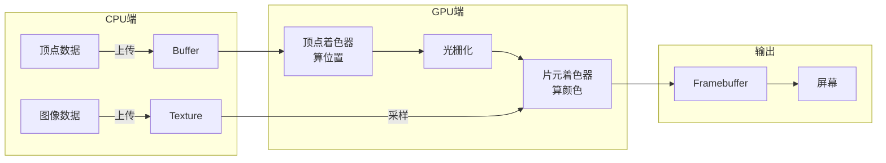
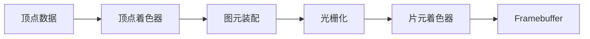
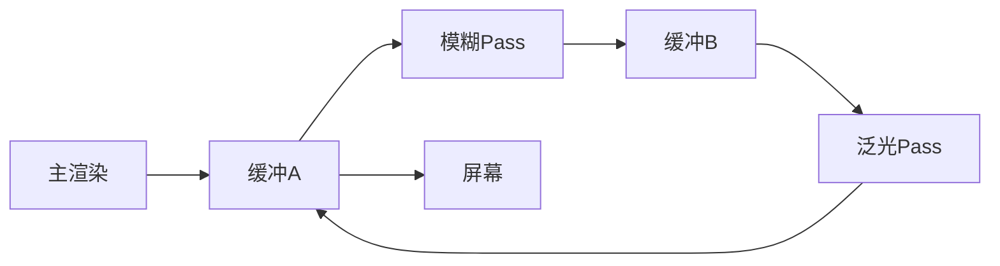
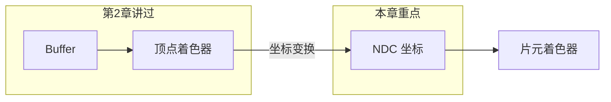
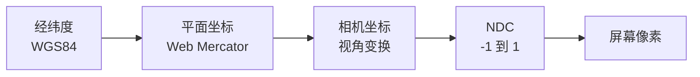
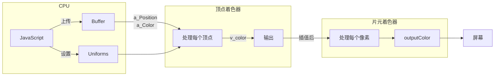

# WebGL 基础与 L7 源码解析

本文从零开始介绍 WebGL 核心概念，并结合 L7 源码帮助理解这些概念在实际项目中的应用。核心是一条数据流：

```
┌─────────────────────────────────────────────────────────────┐
│   你的数据        CPU 准备           GPU 渲染          屏幕     │
│                                                             │
│   经纬度坐标  →  上传到 Buffer  →  顶点着色器  →  像素颜色.       │
│   颜色/大小      创建 Texture      片元着色器      Framebuffer. │
└─────────────────────────────────────────────────────────────┘
```

---

## 1. WebGL 是什么

WebGL 是浏览器中调用 GPU 进行图形渲染的 API，基于 OpenGL ES 标准。

### 与 Canvas 2D 的区别

| 特性     | Canvas 2D    | WebGL          |
| -------- | ------------ | -------------- |
| 执行位置 | CPU          | GPU            |
| 性能上限 | 数千图形元素 | 数十万图形元素 |
| 编程模型 | 命令式       | 着色器编程     |

地图场景需要渲染海量数据并保持 60fps，CPU 无法胜任，所以 L7 选择 WebGL。

---

## 2. L7 渲染一帧的完整流程



### 2.1 CPU 端：准备数据

**Buffer** - 存储顶点数据：

```typescript
// packages/renderer/src/device/DeviceBuffer.ts
this.buffer = device.createBuffer({
  viewOrSize: vertexData, // 顶点数据（位置、颜色、大小）
  usage: BufferUsage.VERTEX, // 用途：顶点缓冲
});
```

**Texture** - 存储图像数据：

```typescript
// packages/renderer/src/device/DeviceTexture2D.ts
this.texture = device.createTexture({
  format: Format.U8_RGBA, // 像素格式
  width,
  height,
  usage: TextureUsage.SAMPLED, // 用途：被着色器采样
});
```

### 2.2 GPU 端：渲染管线

开发者只写两个着色器：

- **顶点着色器**：决定"画在哪"
- **片元着色器**：决定"画什么颜色"



绘制调用入口：

```typescript
// packages/renderer/src/device/DeviceModel.ts
// 绑定 uniform 参数后发起绘制
renderPass.setVertexInput(bindingLayoutDescriptor, vertexBuffers);
renderPass.draw(this.drawElementCount, this.instanceCount);
```

### 2.3 输出：Framebuffer

渲染结果写入 Framebuffer，默认输出到屏幕，也可输出到纹理用于后处理：

```typescript
// packages/renderer/src/device/DeviceFramebuffer.ts
this.colorRenderTarget = device.createRenderTarget({
  format: Format.U8_RGBA,
  width,
  height,
});
```

L7 使用 Ping-Pong 技术做后处理（模糊、泛光等）：



---

## 3. 坐标变换

上一章提到顶点着色器的任务是"算位置"——具体算什么？

你的数据是经纬度（如北京 116.39°E, 39.91°N），但 GPU 只认识 [-1, 1] 范围的 NDC 坐标。**坐标变换就是顶点着色器的核心工作**：把经纬度转成 GPU 能理解的坐标。



变换过程分为以下几步：



### 3.1 经纬度 → 平面坐标

地球是圆的，屏幕是平的。通过投影把球面展开成平面：

```
北京天安门 (116.39°E, 39.91°N) → Web Mercator 平面坐标
```

L7 默认使用 Web Mercator 投影（和 Google 地图一样）。

### 3.2 平面坐标 → 相机坐标

想象你在高空俯瞰地图：

- 你的眼睛位置 = 相机位置
- 你看向的方向 = 相机朝向
- 平移、缩放、旋转地图 = 移动这个虚拟相机

相机坐标就是以相机为原点，重新描述物体的位置。

### 3.3 相机坐标 → NDC

**NDC（标准化设备坐标）** 是 GPU 约定的输入格式，范围固定为 [-1, 1]：

```
        Y
        ↑
        1
        |
-1 -----+----→ 1  X
        |
       -1
```

- 屏幕中心是 (0, 0)
- 超出 [-1, 1] 的图形会被自动裁剪

### 3.4 L7 中的实现

坐标变换在顶点着色器中完成：

```glsl
// packages/core/src/shaders/projection.glsl

// 经纬度 → 平面坐标
vec4 project_pos = project_position(vec4(a_Position.xy, 0.0, 1.0));

// 平面坐标 → NDC（裁剪空间）
gl_Position = project_common_position_to_clipspace(project_pos);
```

这两个函数封装了 L7 的投影逻辑，在所有图层的顶点着色器中都会用到。

---

## 4. Shader 代码解读

本章以 L7 点图层的着色器为例，边读代码边学习 GLSL 语法。

源码位置：`packages/layers/src/point/shaders/fill/`

### 4.1 顶点着色器 fill_vert.glsl

```glsl
// ===== 输入：从 Buffer 读取每个点的属性 =====
in vec3 a_Position; // 经纬度位置 (a_ 前缀 = attribute)
in vec4 a_Color; // 颜色 RGBA
in float a_Size; // 大小

// ===== 全局参数：CPU 传入，所有顶点共享 =====
uniform float u_stroke_width; // 描边宽度 (u_ 前缀 = uniform)

// ===== 输出：传给片元着色器 =====
out vec4 v_color; // (v_ 前缀 = varying，会被插值)

void main() {
  // 传递颜色
  v_color = a_Color;

  // 坐标变换：经纬度 → NDC
  vec4 project_pos = project_position(vec4(a_Position.xy, 0.0, 1.0));
  gl_Position = project_common_position_to_clipspace(project_pos);
}
```

**语法要点**：

| 修饰符    | 含义     | 数据来源                 |
| --------- | -------- | ------------------------ |
| `in`      | 输入     | 顶点着色器从 Buffer 读取 |
| `uniform` | 全局常量 | CPU 设置，所有顶点共享   |
| `out`     | 输出     | 传给下一阶段             |

### 4.2 片元着色器 fill_frag.glsl

```glsl
// ===== 输入：从顶点着色器接收（已被 GPU 插值）=====
in vec4 v_color;
in vec4 v_data; // 包含形状信息

// ===== 输出 =====
out vec4 outputColor;

void main() {
  int shape = int(v_data.w); // 获取形状类型

  // 使用 SDF 计算形状边界
  float outer_df;
  if (shape == 0) {
    outer_df = sdCircle(v_data.xy, 1.0); // 圆形
  } else if (shape == 2) {
    outer_df = sdBox(v_data.xy, vec2(1.0)); // 方形
  }

  // 抗锯齿：边缘平滑过渡
  float alpha = smoothstep(0.0, antialiasblur, outer_df);

  outputColor = v_color;
  outputColor.a *= alpha;
}
```

**语法要点**：

| 函数                  | 作用                    |
| --------------------- | ----------------------- |
| `smoothstep(a, b, x)` | 平滑插值，常用于抗锯齿  |
| `vec4.xy` / `vec4.w`  | 向量分量访问（swizzle） |

### 4.3 数据流总结



---

## 5. 源码速查表

### 渲染器核心

| 概念        | 文件路径                                                      |
| ----------- | ------------------------------------------------------------- |
| Buffer      | `packages/renderer/src/device/DeviceBuffer.ts`                |
| Texture     | `packages/renderer/src/device/DeviceTexture2D.ts`             |
| Framebuffer | `packages/renderer/src/device/DeviceFramebuffer.ts`           |
| 绘制调用    | `packages/renderer/src/device/DeviceModel.ts`                 |
| 渲染 Pass   | `packages/core/src/services/renderer/passes/RenderPass.ts`    |
| 后处理      | `packages/core/src/services/renderer/passes/PostProcessor.ts` |

### 坐标与拾取

| 概念     | 文件路径                                      |
| -------- | --------------------------------------------- |
| 坐标投影 | `packages/core/src/shaders/projection.glsl`   |
| 拾取检测 | `packages/core/src/shaders/picking.vert.glsl` |

### 图层 Shader 目录

| 图层   | 路径                                   |
| ------ | -------------------------------------- |
| 点     | `packages/layers/src/point/shaders/`   |
| 线     | `packages/layers/src/line/shaders/`    |
| 面     | `packages/layers/src/polygon/shaders/` |
| 热力图 | `packages/layers/src/heatmap/shaders/` |
| 栅格   | `packages/layers/src/raster/shaders/`  |
