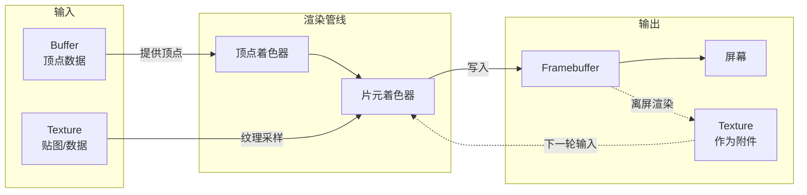
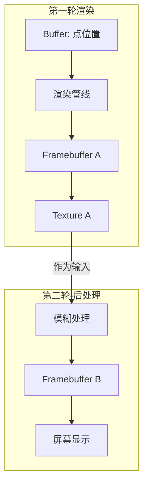
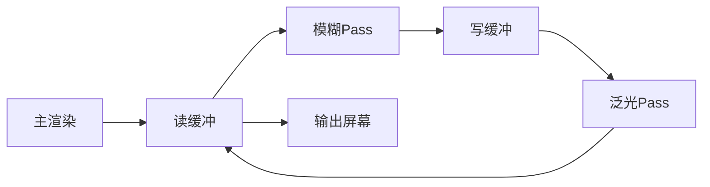
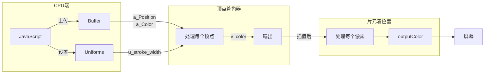

# WebGL 基础与 L7 源码解析

本文从零开始介绍 WebGL 核心概念，并结合 L7 源码帮助理解这些概念在实际项目中的应用。

---

## 1. WebGL 是什么

**WebGL（Web Graphics Library）** 是一套在浏览器中调用 GPU 进行图形渲染的 JavaScript API。它基于 OpenGL ES 2.0/3.0 标准，让网页能够利用显卡的并行计算能力来渲染图形。

### 与 Canvas 2D 的区别

| 特性     | Canvas 2D            | WebGL            |
| -------- | -------------------- | ---------------- |
| 执行位置 | CPU                  | GPU              |
| 绘制方式 | 逐像素顺序绘制       | 并行处理所有像素 |
| 性能上限 | 数千图形元素         | 数十万图形元素   |
| 编程模型 | 命令式（画线、填充） | 着色器编程       |
| 学习曲线 | 简单                 | 陡峭             |

### 为什么地图可视化需要 WebGL

地图场景的典型挑战：

- **海量数据**：一次渲染数万个点、线、面
- **实时交互**：平移缩放时需要 60fps 流畅渲染
- **复杂效果**：热力图、3D 建筑、粒子动画

Canvas 2D 在这些场景下会严重卡顿，而 GPU 的并行架构天然适合这类"对大量数据做相同操作"的任务。

---

## 2. WebGL 核心概念

### GPU vs CPU 的分工

CPU 擅长复杂逻辑和顺序执行，GPU 擅长简单操作的大规模并行。WebGL 的编程模型就是基于这种分工：

```
CPU 端（JavaScript）          GPU 端（着色器）
├── 准备顶点数据              ├── 并行处理每个顶点
├── 上传数据到显存            ├── 并行计算每个像素颜色
├── 设置渲染状态              └── 输出到屏幕
└── 发起绘制调用
```

CPU 负责"准备工作"，GPU 负责"批量计算"。

### 坐标系统

在将图形显示到屏幕之前，需要经历多次坐标转换：

```
经纬度坐标      →    平面坐标      →    相机视角坐标    →    NDC    →    屏幕像素
(WGS84)            (投影后)           (你看到的)         (GPU标准)
```

**1. 经纬度坐标**

就是 GPS/WGS84 坐标，比如北京天安门是 (116.39°E, 39.91°N)

**2. 平面坐标（投影后）**

地球是圆的，屏幕是平的。需要通过"投影"把球面坐标展开成平面。L7 默认使用 Web Mercator 投影（和 Google 地图一样）。

**3. 相机视角坐标**

想象你在高空俯瞰地图：

- 你的眼睛位置 = 相机位置
- 你看向的方向 = 相机朝向
- 你能看到的范围 = 视野

当你平移、缩放、旋转地图时，本质上是在移动这个"虚拟相机"。相机坐标就是以相机为原点，重新描述物体的位置。

**4. 标准化设备坐标（NDC）**

**标准化设备坐标（Normalized Device Coordinates，NDC）** 是坐标转换流程中的关键中间状态。它是一个与屏幕分辨率无关的统一坐标空间，范围固定为 [-1, 1]。

为什么需要 NDC？

- **屏幕无关性**：无论屏幕是 1920×1080 还是 3840×2160，NDC 始终是 [-1, 1]
- **简化裁剪**：超出 [-1, 1] 范围的图形会被自动裁剪掉
- **GPU 标准**：这是 GPU 硬件约定的输入格式

NDC 坐标空间示意：

```
        Y
        ↑
        1
        |
-1 -----+----→ 1  X
        |
       -1
```

- 屏幕中心是 (0, 0)
- 左下角是 (-1, -1)，右上角是 (1, 1)

**5. 屏幕像素坐标**

由 GPU 自动完成，开发者一般不用关心。

在 L7 中，经纬度坐标需要经过**投影变换**才能转换为 NDC 坐标，这部分逻辑在 `packages/core/src/shaders/projection.glsl` 中实现。

---

## 3. 渲染管线

渲染管线是 WebGL 处理数据的流水线，描述了从原始顶点数据到最终屏幕像素的完整过程。

### 五个阶段

```
顶点数据 → 顶点着色器 → 图元装配 → 光栅化 → 片元着色器 → 帧缓冲
                         ↓
                    (三角形)
```

| 阶段           | 做什么                   | 谁控制         |
| -------------- | ------------------------ | -------------- |
| **顶点数据**   | 准备点的位置、颜色等属性 | 开发者（JS）   |
| **顶点着色器** | 对每个顶点做坐标变换     | 开发者（GLSL） |
| **图元装配**   | 把顶点连成三角形         | GPU 自动       |
| **光栅化**     | 把三角形转换成像素点     | GPU 自动       |
| **片元着色器** | 计算每个像素的颜色       | 开发者（GLSL） |
| **帧缓冲**     | 存储最终图像             | 配置性         |

简单记忆：**开发者只需要写两个着色器**——顶点着色器决定"画在哪"，片元着色器决定"画什么颜色"。

### L7 中的实现位置

- **绘制调用入口**：`packages/renderer/src/device/DeviceModel.ts:200-250`
- **渲染 Pass 管理**：`packages/core/src/services/renderer/passes/RenderPass.ts`

---

## 4. 三大 GPU 资源

在 WebGL 中，数据需要从 CPU 内存传输到 GPU 显存才能被处理。有三种主要的 GPU 资源类型：

### Buffer（缓冲区）

**作用**：存储顶点数据（位置、颜色、大小等）或索引数据。

```
CPU 数组数据  ──上传──>  GPU Buffer  ──读取──>  顶点着色器
```

**L7 封装**：`packages/renderer/src/device/DeviceBuffer.ts`

```typescript
// 创建顶点缓冲
this.buffer = device.createBuffer({
  viewOrSize: options.data, // 顶点数据
  usage: BufferUsage.VERTEX, // 用途：顶点缓冲
});
```

### Texture（纹理）

**作用**：存储图像数据，可用于贴图、数据查找表等。

常见用途：

- 给图形贴图片（如地图瓦片）
- 存储颜色映射表（如热力图的色带）
- 存储计算结果供后续使用

**L7 封装**：`packages/renderer/src/device/DeviceTexture2D.ts`

```typescript
// 创建 2D 纹理
this.texture = device.createTexture({
  format: Format.U8_RGBA, // 像素格式
  width,
  height,
  usage: TextureUsage.SAMPLED,
});
```

### Framebuffer（帧缓冲）

**作用**：渲染目标。默认渲染到屏幕，但也可以渲染到一张纹理上（离屏渲染）。

常见用途：

- **后处理效果**：先渲染到纹理，再对纹理做模糊、泛光等处理
- **拾取检测**：渲染一张"ID 图"，通过像素颜色判断点击了哪个图形

**L7 封装**：`packages/renderer/src/device/DeviceFramebuffer.ts`

```typescript
// 创建帧缓冲（包含颜色和深度附件）
this.colorRenderTarget = device.createRenderTarget({...});
this.depthRenderTarget = device.createRenderTarget({...});
```

### 三者关系

**简单来说**：

- **Buffer** = 输入数据（顶点在哪、什么颜色）
- **Texture** = 图像资源（可读可写）
- **Framebuffer** = 输出目标（渲染结果写到哪）

**关系图**：

```
┌─────────────────────────────────────────────────────────────┐
│                      渲染管线                                │
│  ┌─────────┐    ┌──────────┐    ┌──────────┐               │
│  │ Buffer  │───>│ 顶点着色器 │───>│ 片元着色器 │──┐           │
│  │(顶点数据)│    └──────────┘    └────┬─────┘  │           │
│  └─────────┘                        │        │           │
│                                     │采样     │           │
│  ┌─────────┐                        │        ▼           │
│  │ Texture │────────────────────────┘   ┌──────────┐     │
│  │(图像数据)│<──────────────────────────│Framebuffer│     │
│  └─────────┘      可作为附件            │ (渲染目标) │     │
│                                        └──────────┘     │
└─────────────────────────────────────────────────────────────┘
```

**Mermaid 流程图**：



**典型数据流**：



**L7 中的后处理示例**（Ping-Pong 技术）：



---

## 5. GLSL 着色器语言

GLSL（OpenGL Shading Language）是编写着色器的专用语言，语法类似 C 语言，但专为 GPU 并行计算设计。

### 基本语法速查

**数据类型**：

| 类型             | 说明       | 示例                              |
| ---------------- | ---------- | --------------------------------- |
| `float`          | 浮点数     | `float a = 1.0;`                  |
| `int`            | 整数       | `int i = 0;`                      |
| `vec2/vec3/vec4` | 向量       | `vec3 pos = vec3(1.0, 2.0, 3.0);` |
| `mat3/mat4`      | 矩阵       | `mat4 transform;`                 |
| `sampler2D`      | 纹理采样器 | `texture(sampler, uv)`            |

**向量操作**（GLSL 的便捷特性）：

```glsl
vec4 color = vec4(1.0, 0.5, 0.0, 1.0);  // RGBA

color.rgb   // 取前三个分量 → vec3(1.0, 0.5, 0.0)
color.a     // 取第四个分量 → 1.0
color.xy    // 取前两个分量 → vec2(1.0, 0.5)
color.bgr   // 交换顺序取值 → vec3(0.0, 0.5, 1.0)
```

**变量修饰符**：

| 修饰符    | 作用     | 数据流向                                                    |
| --------- | -------- | ----------------------------------------------------------- |
| `in`      | 输入变量 | 顶点着色器：从 Buffer 读取<br/>片元着色器：从顶点着色器接收 |
| `out`     | 输出变量 | 传递给下一阶段                                              |
| `uniform` | 全局常量 | CPU 设置，所有顶点/片元共享                                 |

**内置变量**：

| 变量           | 阶段       | 作用                         |
| -------------- | ---------- | ---------------------------- |
| `gl_Position`  | 顶点着色器 | **必须设置**，顶点的最终位置 |
| `gl_FragCoord` | 片元着色器 | 当前像素的屏幕坐标           |

**常用函数**：

```glsl
mix(a, b, t) // 线性插值：a*(1-t) + b*t
clamp(x, min, max) // 限制范围
smoothstep(a, b, x) // 平滑插值，常用于抗锯齿
length(v) // 向量长度
normalize(v) // 归一化向量
dot(a, b) // 点积
```

### L7 点图层 Shader 解读

以 `packages/layers/src/point/shaders/fill/` 下的着色器为例：

**顶点着色器 (fill_vert.glsl) 核心结构**：

```glsl
// 1. 声明输入属性（从 Buffer 读取）
in vec3 a_Position; // 点的经纬度位置
in vec4 a_Color; // 点的颜色
in float a_Size; // 点的大小

// 2. 声明 uniform（CPU 传入的全局参数）
uniform float u_stroke_width; // 描边宽度

// 3. 声明输出（传给片元着色器）
out vec4 v_color; // v_ 前缀是约定，表示 varying

// 4. 主函数
void main() {
  // 传递颜色给片元着色器
  v_color = a_Color;

  // 坐标投影：经纬度 → NDC
  vec4 project_pos = project_position(vec4(a_Position.xy, 0.0, 1.0));

  // 设置最终顶点位置（必须）
  gl_Position = project_common_position_to_clipspace(project_pos);
}
```

**片元着色器 (fill_frag.glsl) 核心结构**：

```glsl
// 1. 接收顶点着色器的输出（已被 GPU 插值）
in vec4 v_color;
in vec4 v_data; // 包含形状信息

// 2. 声明输出颜色
out vec4 outputColor;

// 3. 主函数
void main() {
  int shape = int(v_data.w); // 获取形状类型

  // 使用 SDF 计算形状边界
  if (shape == 0) {
    outer_df = sdCircle(v_data.xy, 1.0); // 圆形
  } else if (shape == 2) {
    outer_df = sdBox(v_data.xy, vec2(1.0)); // 方形
  }

  // 抗锯齿处理
  float alpha = smoothstep(0.0, antialiasblur, outer_df);

  // 设置最终颜色
  outputColor = v_color;
  outputColor.a *= alpha;
}
```

**数据流可视化**：



---

## 6. 源码速查表

### 概念与文件路径对照

| 概念                 | L7 源码位置                                                   | 说明                 |
| -------------------- | ------------------------------------------------------------- | -------------------- |
| **Buffer 封装**      | `packages/renderer/src/device/DeviceBuffer.ts`                | 顶点/索引缓冲管理    |
| **Texture 封装**     | `packages/renderer/src/device/DeviceTexture2D.ts`             | 2D 纹理管理          |
| **Framebuffer 封装** | `packages/renderer/src/device/DeviceFramebuffer.ts`           | 帧缓冲管理           |
| **渲染模型**         | `packages/renderer/src/device/DeviceModel.ts`                 | 管线状态、绘制调用   |
| **渲染服务入口**     | `packages/renderer/src/device/index.ts`                       | 设备初始化、资源创建 |
| **渲染 Pass**        | `packages/core/src/services/renderer/passes/RenderPass.ts`    | 主渲染阶段           |
| **后处理器**         | `packages/core/src/services/renderer/passes/PostProcessor.ts` | Ping-Pong 后处理     |
| **坐标投影**         | `packages/core/src/shaders/projection.glsl`                   | 经纬度→NDC 转换      |
| **拾取功能**         | `packages/core/src/shaders/picking.vert.glsl`                 | 点击检测着色器       |

### 图层 Shader 目录

| 图层类型 | Shader 位置                            |
| -------- | -------------------------------------- |
| 点图层   | `packages/layers/src/point/shaders/`   |
| 线图层   | `packages/layers/src/line/shaders/`    |
| 面图层   | `packages/layers/src/polygon/shaders/` |
| 热力图   | `packages/layers/src/heatmap/shaders/` |
| 栅格图   | `packages/layers/src/raster/shaders/`  |

### 建议阅读顺序

```
1. DeviceBuffer.ts      → 理解数据如何上传到 GPU
2. DeviceTexture2D.ts   → 理解纹理创建和配置
3. DeviceModel.ts       → 理解完整的绘制流程
4. projection.glsl      → 理解坐标系统转换
5. point/shaders/fill/  → 完整的着色器示例
```
